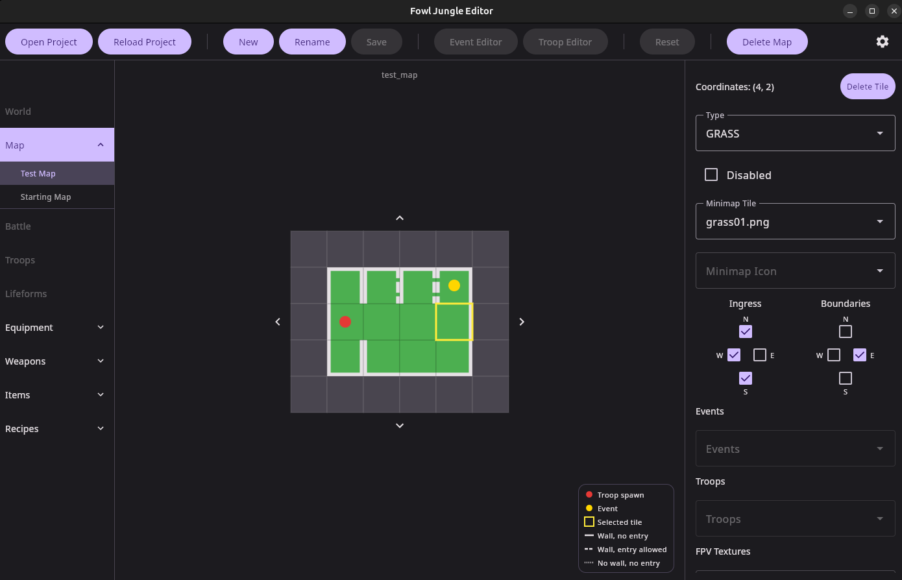

# Fowl Jungle Editor

A desktop GUI editor for [Fowl Jungle](https://github.com/NatePillow/fowl-jungle-public) game data. Parses, edits, and saves the JSON asset files that drive all game content.

## Running

```
./gradlew run
```

## Building Installer

```
./gradlew packageDeb      # Linux
./gradlew packageMsi      # Windows
./gradlew packageDmg      # macOS
```

## Usage

Click **Open Project** and select the `assets/json/` folder from the Fowl Jungle repo. All supported JSON files are loaded automatically from the known directory structure. The last opened folder is restored on next launch.

**Reload** re-reads all files from disk, picking up any external changes. **Save** writes the current editor's changes back to the original file. **Reset** discards unsaved changes and restores the file from disk. Unsaved changes are indicated by `*`.

<div style="display: flex; justify-content: space-between;">
  
</div>

## Editors

| Editor    | Status  | JSON files          |
|-----------|---------|---------------------|
| World     | Planned | `world/*.json`      |
| Map       | Working | `world/maps/*.json` |
| Battle    | Planned | `battles/*.json`    |
| Troops    | Planned | `troops/*.json`     |
| Lifeforms | Planned | `lifeform/*.json`   |
| Equipment | Planned | `equipment/*.json`  |
| Items     | Planned | `items/*.json`      |

## Map Editor

Each JSON file in `world/maps/` appears as an entry under **Map** in the nav rail. Click one to load it. The nav rail can be collapsed by clicking the **Map** button again.

Renders the tile grid as a 2D canvas. Click a tile to select it and edit its properties in the right panel. Click the selected tile again to deselect. Click an empty cell to select it and add a new tile via the **Add Tile** button in the panel.

**Canvas:**
- Tiles colored by type (GRASS, WATER, MOUNTAIN, etc.)
- Wall lines on tile edges encoding both draw boundary and ingress state:
  - Solid — real wall (rendered, impassable)
  - Dashed — fake wall (rendered, but walkable)
  - Dotted — invisible barrier (not rendered, impassable)
- Red dot — troop spawn
- Yellow dot — map event
- Controls:
  - Drag — pan around the map
  - Scroll wheel — zoom in/out (0.5×–2×)

**Tile properties panel:**
- Type, disabled flag, minimap paths
- Ingress toggles (which directions a player can enter from)
- Draw boundary toggles (which sides render a wall)
- FPV texture paths per boundary slot (floor, ceiling, walls, foreground layers)
